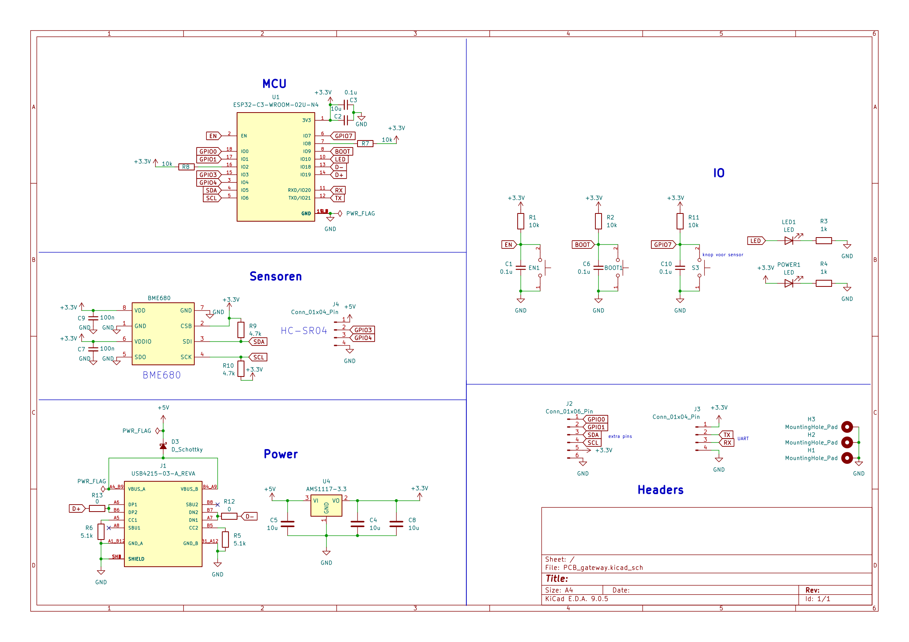

# Gateway for Smart Bike Monitoring System



The purpose of the gateway is to receive data from a smart bike over BLE long range and write it to an InfluxDB database over a WiFi connection.
The dashboard is visualized using Grafana. This accesses the InfluxDB database using its HTTP API.

Both the database and the dashboard are hosted in the cloud using free-tier services. The database is hosted on InfluxDB Cloud and the Grafana dashboard is hosted on Grafana Cloud.

It is also possible to host both the database and the dashboard locally using Docker containers. These could be hosted on a personal server. Instructions for these containers are provided in the /Server folder.


## System overview

```
   Smart Bike
         | (BLE long range)
         v
      Gateway
         | (HTTP API)
         v
   InfluxDB Cloud
         | (HTTP API)
         v
   Grafana Cloud
```

## Code for the Gateway

The code for the gateway is written in c++ using the Arduino framework. It is designed to run on an ESP32 microcontroller with both WiFi and BLE long range capabilities.

## Link to dashboard and database

- Gateway WiFi repeater: https://github.com/martin-ger/esp32_nat_router/tree/master
- InfluxDB Cloud: https://cloud2.influxdata.com/
- Grafana Cloud: https://grafana.com/cloud
- Grafana Dashboard: https://boombike.grafana.net/public-dashboards/a31db9c51b8144fbb526a16ae5137e5a?fbclid=IwY2xjawNm6t9leHRuA2FlbQIxMQABHihIpa4uVn0q4TQ20HxuqrC6knFB-QV5GCWbPZI-nRs55s2GTs8DI9WtZkRM_aem_m_eqAt-B783CyasroQSzHg
